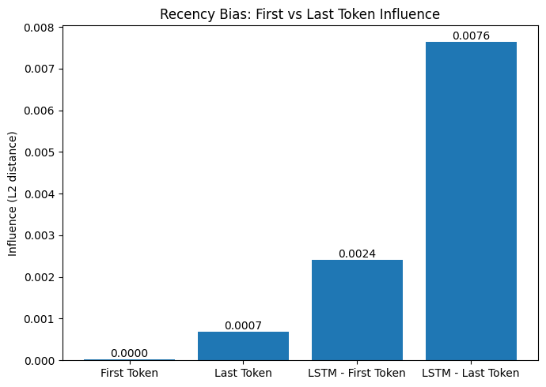
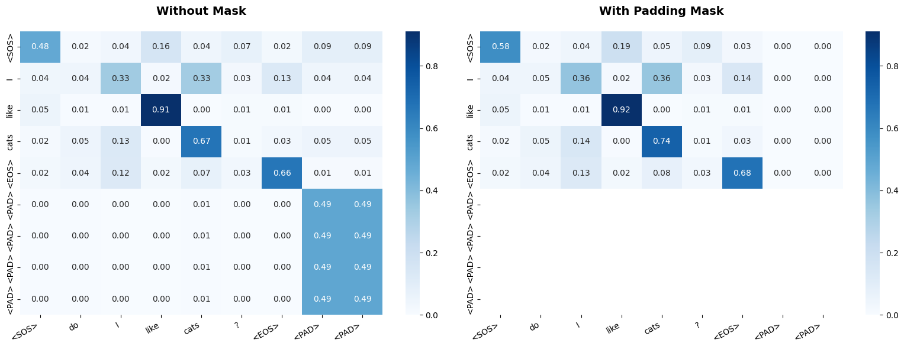
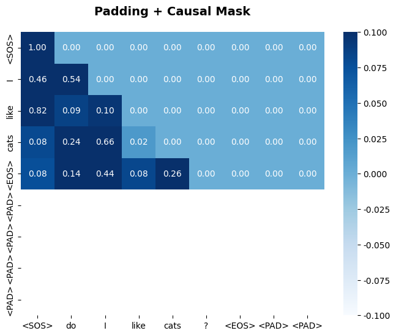
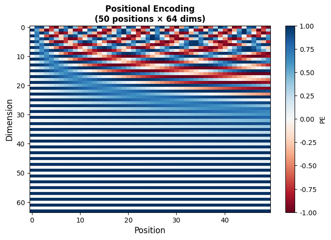
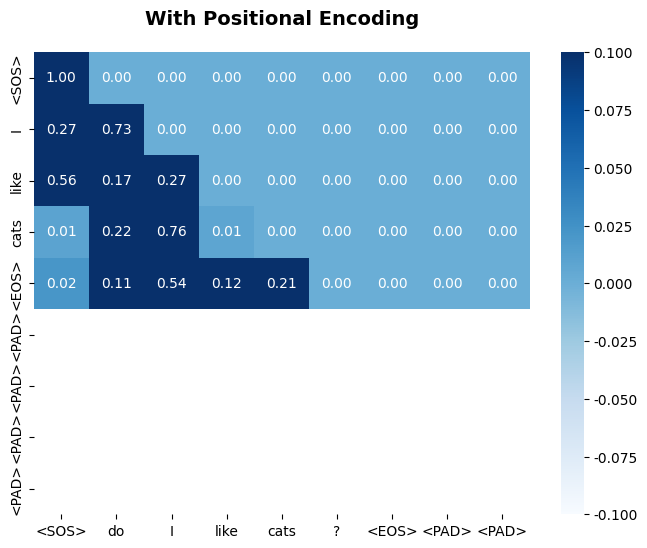
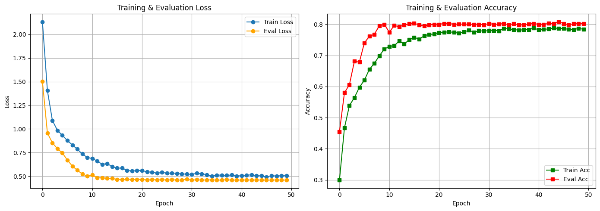
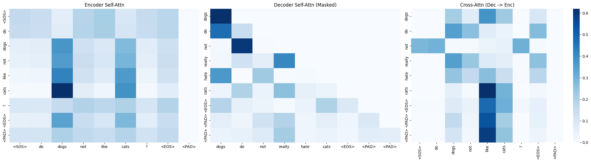
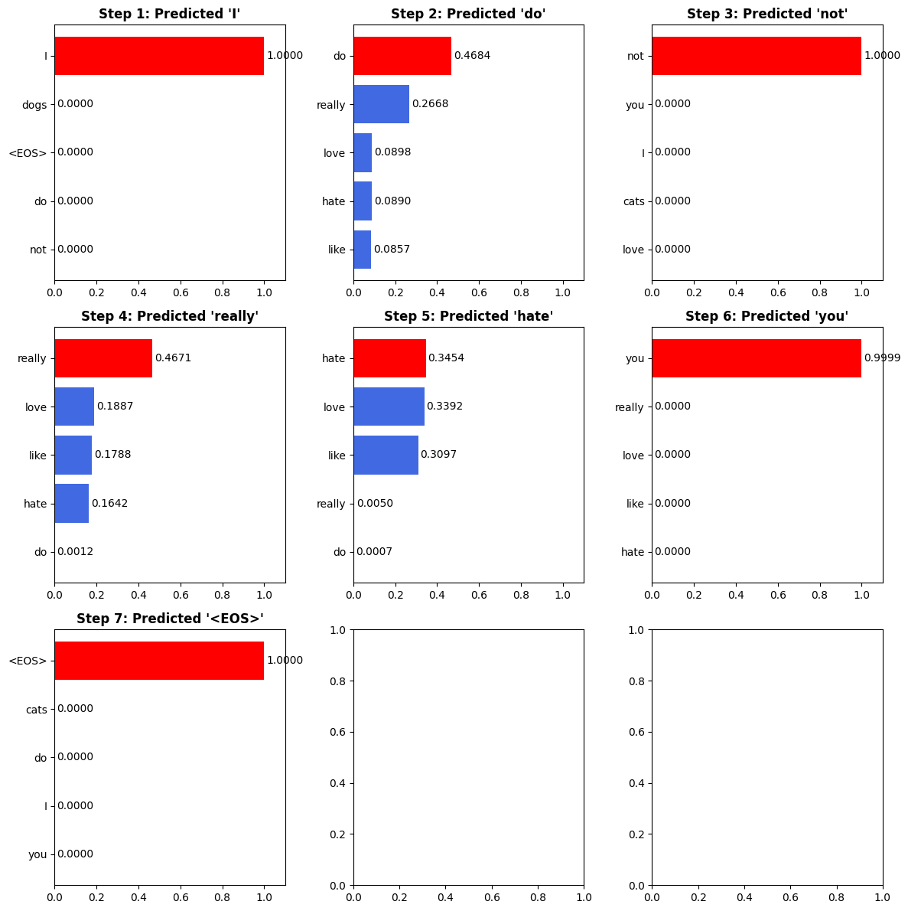

# Transformer 가이드

본 프로젝트는 Transformer 아키텍처의 핵심 개념을 단계별로 학습할 수 있도록 설계된 교육용 가이드입니다. 단순한 데이터셋부터 시작하여 전체 Transformer 모델까지 구현하고 훈련해봅시다.

본 가이드는 Dgist Dgroid LLM study의 2주차 내용입니다.

---

## 목차

1. [Tokenization과 Embedding](#1-tokenization과-embedding)
2. [RNN과 LSTM의 한계](#2-rnn과-lstm의-한계)
3. [Attention Mechanism](#3-attention-mechanism)
4. [마스킹](#4-마스킹)
5. [Positional Encoding](#5-positional-encoding)
6. [Multi-Head Attention](#6-multi-head-attention)
7. [Encoder와 Decoder](#7-encoder와-decoder)
8. [Transformer 구조](#8-transformer-구조)
9. [훈련 프로세스](#9-훈련-프로세스)
10. [학습 결과 및 시각화](#10-학습-결과-및-시각화)

---

## 1. Tokenization과 Embedding

### 개념

언어 모델이 문장을 이해하기 위해선 데이터를 모델이 이해할 수 있는 형태로 바꾸어야 합니다. 

**Tokenization**: 텍스트를 고정된 어휘 집합의 토큰으로 변환하는 과정입니다. 이는 언어 모델의 최소 입력단위입니다. `<SOS>` (Start of Sequence)와 `<EOS>` (End of Sequence), `<PAD>` (Padding) 같은 특수 토큰을 포함합니다.

**Embedding**: 토큰을 고정 차원의 연속 벡터로 변환하여 의미적 유사성을 수치로 표현합니다.

### 구현

본 학습에서는 다음과 같은 어휘를 사용해 문장을 만들었습니다:
- 주어: I, you, cats, dogs
- 동사: like, love, hate
- 수식어: really, not
- 특수 토큰: `<PAD>`, `<SOS>`, `<EOS>`

임베딩 차원은 8로 설정하여 단순한 구조에서 개념을 학습해봅시다.

---

## 2. RNN과 LSTM의 한계

### RNN의 문제점

RNN은 이전 시점의 정보를 현재 시점으로 전달합니다:

$$h_t = \tanh(W_{hh}h_{t-1} + W_{xh}x_t + b)$$

여기서 $h_{t-1} \to h_t$로의 정보 전달은 가중치 곱셈을 통해 이루어집니다. 시퀀스가 길어질수록 초기 정보가 감쇠되는 **Recency Bias** 현상이 발생합니다.

### LSTM의 개선

LSTM은 Cell State라는 별도의 정보 통로를 도입하여 장기 의존성을 개선합니다:

**Forget Gate**: 과거 정보를 버릴지 유지할지 결정
$$f_t = \sigma(W_f \cdot [h_{t-1}, x_t] + b_f)$$

**Cell State Update** (덧셈 기반의 정보 전달 - 핵심)
$$C_t = f_t \odot C_{t-1} + i_t \odot \tilde{C}_t$$

**Hidden State**: 최종 출력 결정
$$h_t = o_t \odot \tanh(C_t)$$

### 실험 결과



실험 결과에서 LSTM이 RNN보다 초기 토큰의 영향을 더 잘 보존하지만 (두 모델 모두 학습되지 않은 상태입니다), 여전히 마지막 토큰이 첫 토큰보다 약 4배 이상 더 큰 영향을 미치는 것을 확인할 수 있습니다. 이는 Attention 메커니즘으로 해결할 수 있습니다.

---

## 3. Attention Mechanism

### Scaled Dot-Product Attention

Attention은 모든 토큰 쌍의 유사도를 한 번에 계산하여 거리 제약 없이 직접 참조할 수 있습니다:

$$\text{Attention}(Q, K, V) = \text{softmax}\left(\frac{QK^\top}{\sqrt{d_k}}\right)V$$

각 성분의 의미:

| 기호 | 의미 | 크기 |
|------|------|------|
| $Q$ (Query) | 현재 위치가 찾는 정보 (검색어) | (seq_len, $d_k$) |
| $K$ (Key) | 각 위치의 식별자 | (seq_len, $d_k$) |
| $V$ (Value) | 각 위치의 실제 정보 | (seq_len, $d_v$) |

### √dₖ의 중요성

$d_k$가 커지면 dot product 값이 극단적으로 커져 softmax에서 매우 작은 그래디언트가 발생합니다. $\sqrt{d_k}$로 정규화하면 점수의 분산을 1로 유지하여 안정적인 학습을 가능하게 합니다.

---

## 4. 마스킹

### 4.1 Padding Mask

배치 내 문장의 길이가 다르므로 짧은 문장은 `<PAD>` 토큰으로 채워집니다. Attention 계산 시 PAD 위치는 무시해야 합니다:

$$
{masked\_score}_{ij} = score_{ij} + \begin{cases}
-\infty & \text{if } j \text{ is } \langle \text{PAD} \rangle \\
0 & \text{otherwise}
\end{cases}
$$

$-\infty$를 더하면 softmax 후 해당 위치의 가중치는 0이 됩니다:

$$\text{Softmax}(z_i) = \frac{e^{z_i}}{\sum_{j=1}^{K} e^{z_j}} \approx 0 \text{ when } z_i \to -\infty$$



### 4.2 Causal Mask (Look-Ahead Mask)

Decoder는 토큰을 순서대로 생성합니다. 위치 $i$의 토큰을 예측할 때, 미래 위치 $j > i$의 정보를 참조하면 안 됩니다:

$$
\text{CausalMask}_{ij} = \begin{cases}
1 & \text{if } j \le i \\
0 & \text{if } j > i
\end{cases}
$$

이는 하삼각 행렬(lower triangular matrix)로 표현됩니다.



---

## 5. Positional Encoding

### 문제

Attention은 위치 정보가 없습니다. 토큰의 순서가 다르면 동일한 Attention 가중치를 생성할 수 있습니다. 따라서 순서 정보를 명시적으로 추가해야 합니다.

### 해결 방법

임베딩에 위치 기반의 벡터를 더합니다. 사인과 코사인 함수를 사용하여 각 위치마다 고유한 벡터를 생성합니다:

$$PE(pos, 2i) = \sin\left(\frac{pos}{10000^{2i/d_{\text{model}}}}\right)$$

$$PE(pos, 2i+1) = \cos\left(\frac{pos}{10000^{2i/d_{\text{model}}}}\right)$$

여기서:
- $pos$: 시퀀스 내의 위치 (0, 1, 2, ...)
- $i$: 임베딩 차원 인덱스
- $d_{\text{model}}$: 모델 차원

차원마다 다른 주파수를 사용하므로 각 위치는 고유한 벡터를 가집니다.



```python
PE = embedding + positional_encoding
```

위치 정보가 추가되면 Attention 가중치가 토큰의 실제 위치에 따라 달라집니다.



---

## 6. Multi-Head Attention

### 동기

단일 Attention은 한 번에 하나의 관계만 강조합니다. 다양한 관계(예: 문법적 관계, 의미적 관계)를 동시에 학습하기 위해 여러 Attention 헤드를 병렬로 사용합니다.

### 수식

$$\text{head}_i = \text{Attention}(QW_i^Q, KW_i^K, VW_i^V)$$

$$\text{MultiHead}(Q, K, V) = \text{Concat}(\text{head}_1, \ldots, \text{head}_h)\,W^O$$

여기서:
- $W_i^Q, W_i^K, W_i^V \in \mathbb{R}^{d_{\text{model}} \times d_k}$, $d_k = d_{\text{model}} / h$
- $W^O \in \mathbb{R}^{d_{\text{model}} \times d_{\text{model}}}$는 출력 프로젝션 행렬
- $h$는 헤드의 개수

각 헤드는 입력을 낮은 차원 부분공간으로 프로젝션하여 계산한 후, 결과를 연결하고 최종 프로젝션을 적용합니다.

---

## 7. Encoder와 Decoder

### 7.1 Residual Connection (잔차 연결)

신경망이 깊어질수록 **Vanishing Gradient** 문제가 발생합니다. Residual Connection은 입력을 출력에 바로 더하여 기울기 소실을 방지합니다:

$$\text{output} = \text{LayerNorm}(x + \text{SubLayer}(x))$$

이를 통해 그래디언트가 여러 경로로 흐를 수 있습니다.

### 7.2 Layer Normalization

각 레이어의 활성화 값을 정규화하여 학습을 빠르고 안정적으로 만듭니다:

$$\text{LayerNorm}(x) = \gamma \frac{x - \mu}{\sqrt{\sigma^2 + \epsilon}} + \beta$$

여기서:
- $\mu$: 각 샘플의 특성 평균
- $\sigma^2$: 특성 분산
- $\epsilon$: 수치적 안정성을 위한 작은 값 (일반적으로 1e-5)
- $\gamma, \beta$: 학습 가능한 스케일과 시프트 파라미터

Batch Normalization과 다르게, Layer Normalization은 배치 차원이 아닌 특성 차원을 정규화합니다.

### 7.3 Feed-Forward Networks (FFN)

Attention 이후 모든 토큰에 개별적으로 적용되는 완전 연결 신경망입니다:

$$\text{FFN}(x) = \max(0, xW_1 + b_1)W_2 + b_2$$

이는 각 위치에서 독립적으로 계산되므로 "Position-wise"라고 불립니다. 보통 중간 차원이 입력 차원의 4배입니다.

### 7.4 Encoder Block

Self-Attention과 FFN을 순차적으로 연결하며, 각 단계에서 Residual Connection과 Layer Normalization을 적용합니다.

### 7.5 Decoder Block

Decoder는 두 개의 Attention을 사용합니다:

1. **Masked Self-Attention**: 자신의 이전 토큰들과만 상호작용 (causal mask 적용)
2. **Cross-Attention**: Encoder의 출력을 참조하여 입력 문장의 모든 토큰에 접근

---

## 8. Transformer 구조

### 전체 아키텍처

Transformer는 Encoder와 Decoder로 구성됩니다:

```
입력 문장 → Encoder → 문맥 표현
                        ↓
              Decoder ← 이전까지 생성된 토큰
                        ↓
                    다음 토큰 예측
```

**Encoder**:
- Embedding + Positional Encoding
- N개의 Encoder Block (Self-Attention + FFN)
- 입력 문장의 문맥 정보를 모두 인코딩

**Decoder**:
- Embedding + Positional Encoding
- N개의 Decoder Block (Masked Self-Attention + Cross-Attention + FFN)
- Encoder 출력을 참조하면서 순차적으로 토큰 생성

### 마스킹 전략

- **Encoder**: Padding Mask만 적용 (PAD 토큰 무시)
- **Decoder 자체 Attention**: Padding Mask + Causal Mask (미래 정보 참조 방지)
- **Decoder 교차 Attention**: Encoder의 Padding Mask만 적용

---

## 9. 훈련 프로세스

### 9.1 순전파 (Forward Pass)

입력 시퀀스를 Encoder와 Decoder를 거쳐 처리하여 각 위치의 토큰 확률 분포를 얻습니다.

### 9.2 손실 계산

Cross-Entropy Loss를 사용하여 예측값과 실제 정답 사이의 오차를 계산합니다:

$$L = -\sum_{i=1}^{n} y_i \log(\hat{y}_i)$$

여기서 PAD 토큰의 손실은 무시합니다 (`ignore_index`).

### 9.3 역전파 (Backward Pass)

Chain Rule을 통해 손실을 역전파하여 각 파라미터의 그래디언트를 계산합니다:

$$\frac{\partial L}{\partial W} = \frac{\partial L}{\partial \text{output}} \cdot \frac{\partial \text{output}}{\partial W}$$

### 9.4 가중치 업데이트

Adam 옵티마이저를 사용하여 파라미터를 업데이트합니다:

$$W_{t+1} = W_t - \eta \cdot \nabla W_t$$

여기서 $\eta$는 학습률입니다. 또한 **Gradient Clipping**을 적용하여 불안정한 학습을 방지합니다.

---

## 10. 학습 결과 및 시각화

### 10.1 데이터셋

QA (Question-Answering) 데이터셋을 생성합니다. 가능한 모든 질문-답변 조합을 생성하여 약 1200개의 쌍을 만듭니다.

예시:
- Q: "Do you like cats?"
- A: "I like cats"

훈련 데이터 80%, 테스트 데이터 20%로 분할합니다.

### 10.2 모델 설정

```
d_model = 8        # 임베딩 차원
d_ff = 32          # FFN 중간 차원 (d_model × 4)
n_layers = 2       # Encoder/Decoder 레이어 수
heads = 2          # Attention 헤드 수
dropout = 0.05     # 정규화
epochs = 50        # 훈련 에포크
```

총 파라미터 수는 약 3500개의 가벼운 모델입니다.

### 10.3 훈련 결과



- 훈련 손실과 평가 손실이 모두 안정적으로 수렴합니다.
- 정확도는 약 70% 이상에 도달합니다.
- 그러나 evalution loss가 train loss보다 낮은 것을 관찰할 수 있습니다.
- 생성된 데이터셋의 특징을 파악하여 원인을 분석해봅시다.
- 또한 실제 NLP 데이터셋에서는 이러한 문제가 생기지 않는 이유를 알아봅시다.

### 10.4 Attention 시각화

훈련된 모델의 Attention 가중치를 시각화해봅시다:



- **Encoder Self-Attention**: 입력 문장의 단어 간 관계 학습
- **Decoder Masked Self-Attention**: 이전 단어들과의 상호작용 (causal mask 적용)
- **Cross-Attention**: 출력 생성 시 입력 문장의 관련 부분 참조

### 10.5 토큰 생성 확률

생성 과정에서 각 단계마다 Top-5 후보 토큰과 확률을 추적해봅시다:



모델이 가장 확률 높은 토큰을 선택하거나, 다양성을 위해 Top-K 샘플링을 사용할 수 있습니다.

---

## 추천 참고 영상

### Transformer&LLM

1. 트랜스포머, ChatGPT가 트랜스포머로 만들어졌죠. - DL5, 3Blue1Brown 한국어
https://www.youtube.com/watch?v=g38aoGttLhI

2. [TTT] 어텐션 & 셀프-어텐션 가장 직관적인 설명! (Attention & Self-Attention), 혁펜하임 | AI & 딥러닝 강의
https://www.youtube.com/watch?v=8E6-emm_QVg

3. Attention/Transformer 시각화로 설명, 임커밋
https://www.youtube.com/watch?v=6s69XY025MU

4. LLM 설명 (요약버전), 3Blue1Brown 한국어
https://www.youtube.com/watch?v=HnvitMTkXro

5. [Deep Learning 101] 트랜스포머, 스텝 바이 스텝, 신박Ai
https://www.youtube.com/watch?v=p216tTVxues

6. Deep Dive into LLMs like ChatGPT, Andrej Karpathy
https://www.youtube.com/watch?v=7xTGNNLPyMI

### DeepLearning Basic
1. 뉴럴네트워크라는걸 들어 보셨다면 보셔야 할 영상. - DL1, 3Blue1Brown 한국어
https://www.youtube.com/watch?v=wrguEHxk_EI

2. [딥러닝] 1-1강. 선형 회귀 | 머신러닝 기초부터 탄탄히!!, 혁펜하임 | AI & 딥러닝 강의
https://www.youtube.com/watch?v=IJRxpLgT7oE&list=PL_iJu012NOxdDZEygsVG4jS8srnSdIgdn

3. 이게 없었다면 지금 AI 는 없었습니다 | 역전파 (Back Propagation), 웰츠랩스 - Welch Labs Korea
https://www.youtube.com/watch?v=kFDvDPj6D4U
